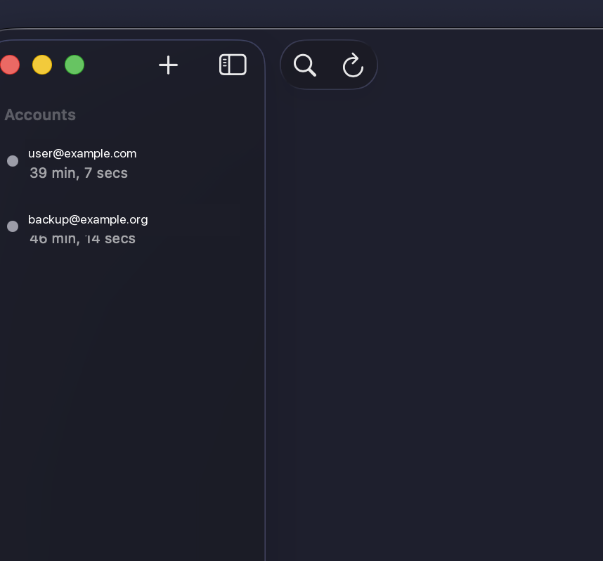

# IMAP Backup

A native macOS menubar app for backing up emails from IMAP servers. Supports Gmail (via App Passwords), IONOS, and custom IMAP servers.




## Features

### Core Backup Features
- **Multi-account support** - Gmail, IONOS, and custom IMAP servers
- **Full mailbox sync** - Downloads all emails, not just unread
- **Incremental backups** - Only downloads new emails on subsequent runs
- **Parallel downloads** - Download multiple emails concurrently for speed
- **Folder hierarchy preservation** - Mirrors your email folder structure
- **Human-readable filenames** - `YYYYMMDD_HHMMSS_sender.eml` format
- **Complete .eml files** - Full RFC 5322 emails with embedded attachments
- **International character support** - Proper RFC 2047 MIME decoding for subjects

### Scheduling & Automation
- **Scheduled backups** - Manual, hourly, daily, or weekly with custom time selection
- **Launch at login** - Start automatically when your Mac starts
- **Menubar app** - Quick access to backup status and controls
- **System notifications** - Get notified when backups complete or fail

### Storage & Management
- **iCloud Drive sync** - Automatically sync backups across your Mac devices
- **Attachment extraction** - Extract attachments to separate folders for easy access
- **Retention policies** - Auto-delete old backups by age or count
- **Backup verification** - Verify backed up emails match server state
- **Large attachment streaming** - Stream large files to disk instead of loading to memory

### Reliability & Performance
- **Connection recovery** - Automatically reconnect on network failures
- **Rate limiting** - Respect server limits with configurable throttling
- **Retry with backoff** - Automatic retry on failures with exponential backoff
- **Detailed error logging** - Debug issues with comprehensive logs

### User Interface
- **Real-time progress** - See download progress, speed, and ETA per account
- **Statistics dashboard** - View total emails, storage size, and folder counts
- **Backup history** - View past backups with details and errors
- **Full-text search** - Search across all downloaded emails by sender, subject, or body
- **Dock icon toggle** - Run as menubar-only app

## Requirements

- macOS 14.0 (Sonoma) or later
- Xcode 15.0+ (for building from source)

## Installation

### From Source

1. Clone the repository:
   ```bash
   git clone https://github.com/kzahedi/imap-backup.git
   cd imap-backup
   ```

2. Build with Xcode:
   ```bash
   xcodebuild -project IMAPBackup.xcodeproj -scheme IMAPBackup -configuration Release build
   ```

3. Copy to Applications:
   ```bash
   cp -R ~/Library/Developer/Xcode/DerivedData/IMAPBackup-*/Build/Products/Release/IMAPBackup.app ~/Applications/
   ```

Or open `IMAPBackup.xcodeproj` in Xcode and build with ⌘R.

## Usage

### Adding an Account

1. Click the "+" button in the sidebar or go to **Settings → Accounts**
2. Select your account type (Gmail, IONOS, or Custom)
3. Enter your email and password
4. Click **Test Connection** to verify
5. Click **Add Account**

### Gmail Setup

Gmail requires an App Password instead of your regular password:

1. Enable 2-Factor Authentication on your Google account
2. Go to [Google App Passwords](https://myaccount.google.com/apppasswords)
3. Generate a new app password for "Mail"
4. Use this 16-character password in IMAP Backup

### IONOS Setup

Use your regular IONOS email password with server `imap.ionos.de` on port 993 (SSL).

### Running a Backup

- **Backup All**: Click in toolbar or menubar to backup all enabled accounts
- **Single Account**: Select an account and click "Start Backup"
- **Scheduled**: Set automatic backups in Settings → Schedule

### Scheduling Options

| Schedule | Description |
|----------|-------------|
| Manual | Only backup when you click the button |
| Hourly | Backup every hour |
| Daily | Backup once per day at your chosen time |
| Weekly | Backup once per week at your chosen time |

### Storage Options

- **Local Storage**: Backups saved to `~/Documents/IMAPBackup/`
- **iCloud Drive**: Sync backups across all your Macs automatically
- **Custom Location**: Choose any folder via Settings → General

## Advanced Features

### Search Emails

Search across all backed up emails with full-text search:

1. Press **⌘F** or click **Search** in the toolbar
2. Enter your search query
3. Results show matching emails with highlighted snippets
4. Double-click to open the email file in your default email client

Search looks through:
- Sender names and email addresses
- Email subjects
- Email body (plain text and HTML)
- Attachment filenames

### Attachment Extraction

Extract attachments to separate folders for easy access:

1. Go to **Settings → Storage**
2. Enable **Extract Attachments**
3. Choose whether to create subfolders per email

Extracted attachments are saved alongside your emails:
```
IMAPBackup/
└── user@example.com/
    └── INBOX/
        ├── 20240115_143022_John_Smith.eml
        └── attachments/
            └── 20240115_143022_John_Smith/
                ├── document.pdf
                └── image.png
```

### Retention Policies

Automatically manage backup storage:

1. Go to **Settings → Storage**
2. Choose a retention policy:
   - **Keep All**: Never delete backups (default)
   - **By Age**: Delete backups older than X days
   - **By Count**: Keep only the most recent X emails per folder

### Backup Verification

Verify your backups match the server:

1. Select an account
2. Click **Verify Backup** in the toolbar
3. View results showing:
   - Emails synced correctly
   - Emails missing locally
   - Emails deleted on server

### Rate Limiting

Prevent server throttling with configurable rate limits:

1. Go to **Settings → Advanced**
2. Choose a preset:
   - **Balanced**: 100ms delay, 5 concurrent (default)
   - **Conservative**: 500ms delay, 2 concurrent (for strict servers)
   - **Aggressive**: 50ms delay, 10 concurrent (for fast servers)
3. Or set custom values

The app automatically detects throttling and backs off exponentially.

### Error Logging

Debug issues with detailed logs:

1. Go to **Settings → Advanced**
2. View logs location: `~/Library/Logs/IMAPBackup/`
3. Logs include:
   - Connection attempts and failures
   - Download progress and errors
   - Throttling events
   - Recovery attempts

## Backup Structure

```
IMAPBackup/
└── user@example.com/
    ├── INBOX/
    │   ├── 20240115_143022_John_Smith.eml
    │   └── 20240115_091544_Jane_Doe.eml
    ├── Sent/
    └── Work/
        └── Projects/
```

### File Naming

Emails are saved with human-readable names:
```
YYYYMMDD_HHMMSS_sender.eml
```

Example: `20240115_143022_John_Smith.eml`

### File Format

Each `.eml` file is a complete RFC 5322 email containing:
- All headers (From, To, Subject, Date, Message-ID, etc.)
- Plain text and HTML body
- Attachments (embedded as MIME parts)

You can open `.eml` files directly in Apple Mail or any email client.

## Architecture

```
IMAPBackup/
├── App/                        # App entry point, delegate, menubar
├── Models/
│   ├── EmailAccount.swift      # Account configuration (Keychain storage)
│   ├── BackupState.swift       # Progress tracking
│   └── Email.swift             # Email metadata
├── Services/
│   ├── BackupManager.swift     # Backup coordination, scheduling
│   ├── IMAPService.swift       # IMAP protocol implementation
│   ├── StorageService.swift    # File system operations
│   ├── EmailParser.swift       # RFC 2047/5322 parsing
│   ├── SearchService.swift     # Full-text email search
│   ├── AttachmentService.swift # MIME attachment extraction
│   ├── RetentionService.swift  # Backup retention policies
│   ├── VerificationService.swift # Backup verification
│   ├── RateLimitService.swift  # Throttling and rate limiting
│   └── LoggingService.swift    # Error and debug logging
└── Views/
    ├── MainWindow/             # Account list, details, settings
    ├── MenubarView.swift       # Menubar dropdown
    └── Components/             # Reusable UI components
```

### Key Technologies

- **SwiftUI** - Modern declarative UI
- **Network.framework** - Low-level IMAP over TLS
- **Swift Concurrency** - async/await for all network operations
- **IMAP Protocol** - Direct implementation (LIST, SELECT, UID FETCH)

## Troubleshooting

### Authentication Failed

- **Gmail**: Make sure you're using an App Password, not your regular password
- **IONOS**: Try both `imap.ionos.de` and `imap.1und1.de`
- Verify your password doesn't have trailing spaces
- Check if your account has 2FA enabled (requires app password)

### Connection Issues

- Check your firewall allows outbound connections on port 993
- Verify the IMAP server address is correct
- Ensure SSL is enabled for port 993
- Try the "Test Connection" button to diagnose issues

### Server Throttling

If backups are slow or failing with "too many connections":

1. Go to **Settings → Advanced**
2. Switch to **Conservative** rate limiting preset
3. Or reduce concurrent connections to 2

### Large Mailboxes

For accounts with 50,000+ emails:

- Initial backup may take several hours
- Enable **Conservative** rate limiting to avoid throttling
- Use **iCloud Drive** storage for automatic sync across devices
- Check logs at `~/Library/Logs/IMAPBackup/` if issues occur

### Disk Space

If running low on storage:

1. Enable **Retention Policies** in Settings → Storage
2. Set **By Age** to delete backups older than 90 days
3. Or use **By Count** to keep only recent emails

### Finding Log Files

Debug logs are stored at:
```
~/Library/Logs/IMAPBackup/backup.log
```

Open Console.app and filter by "IMAPBackup" to view live logs.

## Contributing

Contributions are welcome! Please open an issue or pull request.

## License

MIT License - see [LICENSE](LICENSE) for details.

## Acknowledgments

Built with Swift and SwiftUI for macOS.
